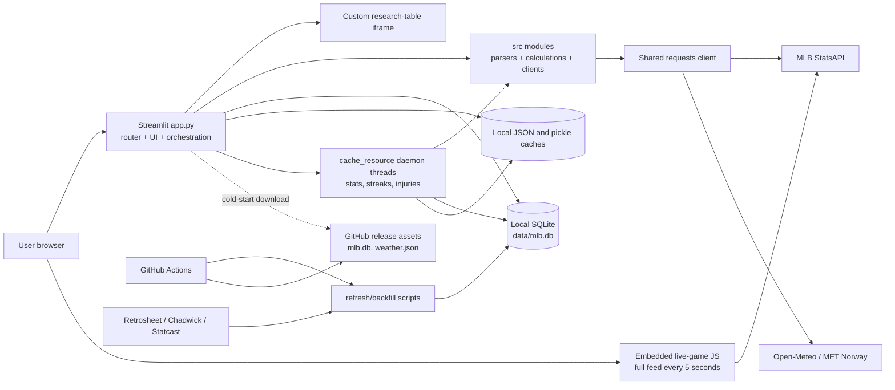

# Current-state repository and architecture audit

Audit date: 2026-07-11  
Repository: All Rise Analytics  
Scope: tracked source, ignored runtime data, SQLite metadata, current workflows, local Streamlit behavior, and non-mutating performance probes.

## Executive assessment

All Rise Analytics is a feature-rich, working Streamlit application with a useful body of reusable Python analytics. The primary constraint is architectural, not functional: one 15,642-line entry point currently combines routing, UI, CSS, HTML/JavaScript rendering, state, orchestration, polling, filesystem caching, and some database writes.

The repository already contains good extraction candidates: batched BvP reads, a shared HTTP client with timeouts/retries, isolated pitch and bullpen calculations, live-feed parsers, weather calculations, and 85 passing tests. Those should be preserved. The unsafe path is a wholesale rewrite. The recommended path is to put contracts around those calculations, migrate persistence and jobs, then replace one UI slice at a time.

The five highest-priority findings are:

1. Production state is a roughly 900 MB local SQLite file that may be downloaded and schema-initialized during a web-process cold start.
2. `st.cache_resource` owns unbounded daemon polling loops. They duplicate across cache keys and instances and have no distributed coordination or shutdown lifecycle.
3. Live games are parsed and rendered twice: once in Python and again in embedded browser JavaScript that downloads the complete MLB live feed every five seconds per user.
4. Interactive paths mutate SQLite and local JSON/pickle files, creating cache invalidation, locking, divergence, and race risks.
5. The actual SQLite file has schema drift from the source-defined schema, while destructive aggregate rebuilds and an incremental Statcast summary bug make a controlled data migration essential.

## Repository facts

| Item | Observed state |
|---|---|
| Application entry point | `app.py` |
| Entry-point size | 15,642 lines, 520,334 bytes, 297 top-level functions |
| Largest Python module after entry point | `src/database.py`, 2,816 lines |
| UI organization | Custom router; no Streamlit `pages/` directory |
| Extracted UI | `src/ui/bvp_research_page.py`, 952 lines |
| Persistence | SQLite at `data/mlb.db`, 900,177,920 bytes |
| Current cache | Streamlit process cache, module dictionaries, JSON, pickle, SQLite |
| External data | MLB StatsAPI, Open-Meteo, MET Norway, Retrosheet, Chadwick Register, pybaseball/Statcast, GitHub release assets |
| Scheduled execution | Two GitHub Actions workflows |
| Runtime dependencies | Four unpinned packages: NumPy, pandas, requests, Streamlit |
| Refresh-only dependency | Unpinned pybaseball |
| Test baseline | 85 passing tests |
| Missing platforms | No FastAPI, Next.js, PostgreSQL client/ORM, Alembic, Redis, worker, object storage, Docker, Compose, or Cloud Run configuration |

## Current file structure

```text
.
|-- app.py                         # Streamlit entry point, router, most UI
|-- src/
|   |-- database.py                # SQLite bootstrap, schema, reads, writes
|   |-- api_client.py              # requests session, concurrency, retries
|   |-- mlb_schedule.py            # schedule fetch + local JSON fallback
|   |-- stat_data.py               # season stats, hand splits, DB facades
|   |-- live_game.py               # MLB clients, parsers, streak helpers
|   |-- weather.py                 # weather clients and calculations
|   |-- injuries.py                # transaction/roster injury inference
|   |-- matchups.py                # matchup table orchestration
|   |-- matchup_grading.py         # pure hitter grading
|   |-- scoring.py                 # pitcher matchup calculations
|   |-- pitch_analysis.py          # pure pitch analytics/shrinkage
|   |-- pitch_data.py              # Statcast normalization and persistence
|   |-- bullpen_projection.py      # pure availability/matchup projection
|   |-- bvp_research.py            # research orchestration + DB writes
|   |-- advanced_bvp_data.py       # batch pitch profile facades
|   |-- recent_form.py             # recent-form calculation + HTML
|   |-- team_mappings.py           # Retrosheet mappings
|   |-- time_utils.py              # application timezone
|   |-- background.py              # anonymous daemon thread helper
|   `-- ui/bvp_research_page.py    # only extracted Streamlit page
|-- components/research_table/
|   `-- index.html                 # generic custom iframe component
|-- refresh_database.py            # completed-game StatsAPI ingest
|-- refresh_nightly.py             # multi-date orchestration + rebuild
|-- backfill_database.py           # Retrosheet/Chadwick historical import
|-- refresh_weather_cache.py       # published weather cache builder
|-- scripts/
|   |-- refresh_pitch_data.py      # rolling Statcast ingest
|   `-- backfill_pitch_data.py     # historical Statcast ingest
|-- tests/                         # 19 test modules, 85 tests
|-- .github/workflows/
|   |-- refresh-data.yml
|   `-- refresh-weather.yml
|-- .streamlit/config.toml
|-- .devcontainer/devcontainer.json
|-- requirements*.txt
|-- runtime.txt
`-- README.md
```

Ignored runtime data currently includes the SQLite file, dated schedule and injury JSON files, and two season streak-history pickles. The 2026 hitting streak pickle is approximately 7.4 MB and the pitching pickle approximately 2.0 MB.

## Current architecture



### Entry point and navigation

The app uses eight custom top-level views: Matchups, Games, Weather, Streaks, Players, Player Stats, Team Stats, and Details (`app.py:14583-14630`). A conditional block dispatches them near the end of the file (`app.py:15525-15573`). There is no separate Home page; Games is the default. Details currently serves methodology and glossary content.

The browser smoke check confirmed that custom button navigation writes query parameters. Some deep-link state is preserved (`view`, matchup table, game, game tab, player, Advanced HVP IDs/mode), but global date, ordinary matchup filters, streak/stat filters, team filters, and profile season remain session-only (`app.py:4620-4833`; `src/ui/bvp_research_page.py:86-144`). A refresh can therefore lose critical research context.

### Verified feature inventory

| Area | Current behavior | Principal implementation |
|---|---|---|
| Today's Games | Schedule, scores, status, probable pitchers, venue, weather, wind, game selection | `app.py:6316-6650`, `10181-10229` |
| Game Center: Live | Score/count/outs/bases, current players, strike zone, field/contact, ABS, plays, modal detail | `app.py:6869-10014`; `src/live_game.py` |
| Game Center: Stats | Contact fields, momentum, team contact comparison | `app.py:7799-8097`, `10017-10029` |
| Game Center: Box Score | Team toggles, batter/pitcher tables, profile navigation | `app.py:10031-10081` |
| Weather | Forecast, roof, wind animation, air density, hitter/pitcher adjustment | `app.py:5598-6284`; `src/weather.py` |
| Matchups | Hitter-pitcher, hand split, pitcher strikeout matchup, logs, grading | `app.py:12360-14449`; `src/matchups.py` |
| Advanced HVP | Exact pitches, location, pitch sequences, projected bullpen | `src/ui/bvp_research_page.py`; `src/bvp_research.py` |
| Streaks | Batter, pitcher, and team win streaks with live context | `app.py:10254-11095` |
| Players | Search, profiles, rosters, seasons, pitch types, logs, recent form | `app.py:11625-12358` |
| Player Stats | Batter and pitcher leaderboards | `app.py:11654-11723` |
| Team Stats | Batting/pitching total and per-game rankings | `app.py:11097-11623` |
| Details | How it works, disclaimer, glossary | `app.py:15572-15636` |
| Injuries | Embedded badges/context, not a standalone page | `src/injuries.py`; matchup/streak renderers |

No audited feature should be removed during migration. Unused implementations may be deleted only after the replacement flow has parity coverage and no call sites.

## Module and extraction assessment

| Current area | Assessment | Destination |
|---|---|---|
| `src/matchup_grading.py` | Pure, small, well suited to parity tests | Shared domain package |
| `src/scoring.py` | Mostly pure pitcher calculations | Shared domain package |
| `src/pitch_analysis.py` | Pure normalization, rates, shrinkage, grading | Shared domain package |
| `src/bullpen_projection.py` | Strong pure calculation seam | Shared domain package |
| `src/pitch_data.py` | Normalization is reusable; persistence is coupled | Split domain transformer from job/repository |
| `src/live_game.py` | Parsers/calculations reusable; HTTP calls mixed in | Split domain parser from MLB client |
| `src/weather.py` | Useful pure calculations mixed with three providers | Split domain weather logic from clients |
| `src/matchups.py` | Business orchestration mixed with DataFrames and lookups | Application service using repository DTOs |
| `src/bvp_research.py` | Orchestration performs reads and request-time writes | Application service plus repository; writes become jobs |
| `src/database.py` | Giant SQLite bootstrap/schema/repository module | Temporary legacy adapter; replace with focused SQLAlchemy repositories |
| `src/stat_data.py` | Stats clients, module cache, DB facades mixed | Split MLB client, cache service, repositories |
| `app.py` streak/stats builders | Business calculations trapped in UI | Extract and parity-test before page work |
| `render_*`, SVG, HTML, CSS | Presentation specification, not backend logic | React components and design tokens |
| `src/background.py` | Process-local daemon helper | Deprecate in favor of worker/jobs |

## Persistence audit

### Actual SQLite inventory

The local file passes `PRAGMA quick_check`, uses WAL, reports schema version 5, and contains 19 application tables, 33 explicit indexes, and 14 automatic primary-key indexes.

| Table | Rows | Role |
|---|---:|---|
| `games` | 50,655 | Historical game identity/context |
| `players` | 6,304 | MLB/Retrosheet player identity |
| `processed_games` | 50,655 | Ingest checkpoint |
| `batter_pitcher_game_logs` | 2,313,456 | Per-game BvP aggregates |
| `batter_pitcher_stats` | 1,011,578 | Career BvP summaries |
| `pitcher_game_logs` | 415,220 | Per-game pitcher results |
| `pitcher_stats` | 16,225 | Season pitcher summaries |
| `live_game_contacts` | 506 | Persisted contact plays |
| `daily_bullpen_projections` | 9 | Request-generated bullpen cache |
| `refresh_log` | 51 | Coarse refresh history |
| `active_players` | 0 | Present only in actual DB drift |
| `batter_pitch_type_game_logs` | 0 | Prepared advanced table |
| `batter_pitch_type_stats` | 0 | Prepared advanced table |
| `pitcher_pitch_type_game_logs` | 0 | Prepared advanced table |
| `pitcher_pitch_type_stats` | 0 | Prepared advanced table |
| `pitch_level_events` | 0 | Prepared Statcast table |
| `plate_appearance_sequences` | 0 | Prepared Statcast table |
| `bvp_pitch_type_stats` | 0 | Prepared Statcast summary |
| `pitch_types` | 0 | Pitch lookup |

### Schema quality and drift

- `init_database()` hand-writes schema and upgrades (`src/database.py:294-844`); there is no migration history or rollback mechanism.
- The actual database contains `active_players`, `players.active_status`, and related indexes, but the current DDL does not create them. Source and deployed data can therefore have different schemas while sharing `user_version = 5`.
- Dates and timestamps are stored as `TEXT`; team identities are frequently denormalized strings.
- No table declares a foreign key. Enabling `PRAGMA foreign_keys` does not provide referential integrity without constraints (`src/database.py:212-225`).
- `batter_pitcher_stats` is a career aggregate and intentionally lacks a season key; the future schema must preserve that semantic or name it explicitly as career data.
- `init_database()` performs backfill `UPDATE` statements and index creation during process initialization and drops a legacy table (`src/database.py:720-844`). A web instance should never migrate production schema on startup.
- Each repository call creates a new SQLite connection; there is no connection pool (`src/database.py:229-281`).

Several indexes are exact duplicates of primary keys or prefixes of larger indexes. Examples include the explicit BvP summary pair index, batter pitch-type batch index, pitch-level game/pitch index, and the short BvP pair index. They should not be copied to PostgreSQL without query-plan evidence.

### Data freshness and identifier findings

The audited database's Retrosheet facts span 2005-04-03 through 2025-09-28. Its StatsAPI facts span 2026-03-25 through 2026-06-22, and the latest `refresh_log` record is 2026-06-23. On the 2026-07-11 audit date, the fact data is therefore stale even though later UI/local writes gave the database file a newer modification time. File mtime is not a valid data-freshness signal.

All 49,486 Retrosheet games have null MLB home/away team IDs. Team normalization must be an explicit migration transformation rather than an assumed foreign-key load.

`backfill_database.py:50-56` creates a negative signed 63-bit synthetic key for Retrosheet games. In the current data, 49,441 of 49,486 such keys exceed JavaScript's safe integer magnitude. Historical game identifiers must be strings at the API boundary; serializing the legacy key as a JSON number would corrupt identity in Next.js.

### Bootstrap and download behavior

`get_connection()` can synchronously bootstrap the database from a hard-coded GitHub release, expand it to local disk, validate only its SQLite header unless an optional checksum is configured, enable WAL, and then initialize the schema (`src/database.py:19-29`, `91-233`, `848-853`). Automatic fallback can make as many as eight 90-second HTTP attempts across outer and shared-client retries. If all downloads fail, initialization can continue with an empty local schema.

Consequences:

- cold starts are coupled to GitHub availability and a very large download;
- every horizontally scaled instance gets divergent ephemeral state;
- process locks do not coordinate multiple processes or instances;
- local disk capacity/startup deadlines become production dependencies;
- an optional integrity control is not a mandatory published manifest;
- a failed download can look like valid but empty data.

The downloader also has no decompressed-size/free-disk limit, does not run `quick_check` before replacement, and logs a configured URL on failure. A signed URL could therefore leak query credentials into logs. Existing but corrupt files skip bootstrap because existence alone suppresses download.

### Current write paths

| Mutation | Trigger | Risk |
|---|---|---|
| Schedule JSON write | Successful UI schedule fetch, `src/mlb_schedule.py:35-45, 212` | Request mutation; same temporary path can race |
| Injury JSON write | Per-date daemon thread, `app.py:14773-14818` | Non-atomic; different team sets overwrite same date file |
| Streak pickle write | Five-minute daemon loops, `app.py:15149-15268` | Untrusted pickle format, no lock/atomic replace, same season path |
| Live contacts | Live page request, `app.py:9743-9778` | SQLite write in a user request |
| Bullpen projection | Advanced HVP request, `src/bvp_research.py:437-462` | SQLite cache write in a user request |
| Schema initialization | First connection per process, `src/database.py:294-853` | DDL/data updates and locks in web runtime |
| Completed-game ingest | refresh scripts | Correctly outside UI, but followed by global rebuild |
| Statcast tables | pitch refresh/backfill scripts | Separate transactions and incorrect multi-window summary semantics |

`db_cache_key()` includes file mtime and size (`src/database.py:236-255`). A live-contact or bullpen write changes the global key and invalidates unrelated matchup, pitch-profile, streak, and research caches. Under WAL, the inverse can also occur: a commit may initially change only `mlb.db-wal`, leaving the main-file mtime unchanged and cached reads stale until checkpoint. Explicit data-generation versions are required.

### Statcast correctness finding

`save_statcast_frame()` computes season-level BvP pitch summaries only from the current input frame, then upserts those values (`src/pitch_data.py:134-196`; `src/database.py:2549-2576`). Rolling refreshes and multi-window backfills therefore overwrite a season/pair/pitch summary with the last window rather than merging or rebuilding from all stored events. The event, plate-appearance, and summary writes also use three independent transactions, so a failure can leave them inconsistent. This must be fixed and backfilled before advanced pitch summaries are treated as authoritative.

## Refresh, backfill, and workflow audit

### Python jobs

- `refresh_database.py` loads a date's schedule, fetches each final game feed sequentially, parses BvP/pitcher/pitch-type rows, and commits each game. It catches per-game errors and continues, which is a useful behavior to preserve (`refresh_database.py:584-741`).
- `refresh_nightly.py` checks a lookback or season-to-date range, then unconditionally rebuilds every summary table (`refresh_nightly.py:29-94`). The rebuild is not incremental.
- `backfill_database.py` streams Retrosheet season archives and uses Chadwick ID mapping. It is correctly separate from UI, but command/path concerns are mixed with domain parsing.
- `scripts/refresh_pitch_data.py` and `scripts/backfill_pitch_data.py` keep pybaseball out of interactive imports, which should be retained.
- `refresh_weather_cache.py` generates a multi-day JSON artifact rather than persisted normalized weather records.

Additional correctness/operational issues:

- Retrosheet season replacement deletes by season rather than `(source, season)`, so a same-season import can delete StatsAPI facts. Its delete set also omits several newer pitch/live/projection tables (`src/database.py:1480-1522`).
- A completed-game refresh records individual failures but returns normally with `completed_with_errors`; the workflow can still publish the resulting database.
- If a nightly date-level schedule call fails, later dates are not isolated in the same way individual games are.
- The four summary rebuilds commit separately, so a failure can leave different tables on different generations.
- Backfill source archives and Chadwick mapping files do not record a pinned source revision/checksum in the database.

### GitHub Actions

`refresh-data.yml` runs tests, downloads or builds the 900 MB SQLite database, refreshes it, compresses it, and overwrites GitHub release assets. It runs nightly and on every push to `main`, has `contents: write`, and uses a single concurrency group.

`refresh-weather.yml` runs every 15 minutes and on every push to `main`, then overwrites `weather.json` in the same release. Its concurrency group is separate from the database workflow, so first-time release creation and release updates are not globally coordinated.

These workflows are current production data infrastructure, not ordinary CI. They should remain until Cloud Run Jobs are verified, then be disabled in a reversible cutover rather than deleted immediately.

## Caching, state, polling, and reruns

### Process-local cache

There are 24 Streamlit `cache_data` functions and five `cache_resource` job-like functions. TTLs range from two seconds for live feed to six hours for historical data. Matchup cache functions accept entire DataFrames, requiring Streamlit to hash/copy them. `src/stat_data.py:18` also maintains an unbounded module-level hand-split dictionary.

`st.session_state` appears 132 times. It retains complete weather DataFrames by date without an eviction bound and keeps per-game live feed/contact/animation state after navigation (`app.py:15372-15384`, `9743-9816`). This state is per session, cannot be shared across instances, and is only partially represented in URLs.

### Daemon monitors

| Monitor | Frequency | Fan-out/problem |
|---|---:|---|
| Live streak | 30 seconds | One box-score call per live or final game; final games keep polling |
| Season stats | 10 minutes | Two all-player StatsAPI calls per process |
| Streak history | 5 minutes | Career game logs for candidate player sets; full pickle rewrite |
| Injuries | Once per cache key | Transaction request plus a 40-man roster request per team |
| Hand split preload | Once per season key | Executor has no explicit shutdown |

The loops are anonymous daemon threads started by `src/background.py:12-15`. Cache keys include game/player/team tuples, so changing dates and slates creates additional resources that do not stop. Multiple app instances multiply all work.

### Live-game path

The initial render fetches and parses a live feed in Python. An embedded component then calls MLB directly every five seconds, reparses the complete payload with a second JavaScript implementation, and replaces the complete live shell (`app.py:8683-9457`). This creates 12 upstream full-feed requests per minute per browser, bypasses server retries/rate controls/logging, and lets Live, Stats, and Box Score show different snapshots. Browser-updated contacts are not reliably persisted because persistence occurs only on a later Python render.

## External API audit

| Provider/path | Current batching | Remaining fan-out or concern |
|---|---|---|
| MLB schedule + pitcher hands | One schedule and one bulk people call | UI writes a local fallback JSON |
| MLB season stats | One all-player request per group | Repeated by each process every 10 minutes |
| MLB hand splits | One all-player request | Module-level cache, no shared freshness/version |
| MLB injury context | Transactions plus one roster/team | N-team fan-out on interactive pages |
| MLB active rosters | One request/team, parallel | N-team fan-out and no shared cache |
| MLB live box scores | One request/game/30 seconds | N-game fan-out per process |
| MLB live feed | One full request/browser/5 seconds | Bypasses backend control and observability |
| Player career logs | Chunks of five players | Large fan-out and memory use for streak refresh |
| Weather | Open-Meteo batch | On failure, one MET call/location then possible MLB call/game |
| Statcast | Windowed pybaseball calls in scripts | Summary overwrite bug; potentially large DataFrames |

`src/api_client.py` is a useful shared seam: it supplies a session, user agent, timeouts, a semaphore, and bounded retries. It lacks structured timing, jitter, trace/request IDs, circuit state, and cross-instance rate limiting. Some higher-level weather retries layer on top of client retries, which can multiply latency.

## Performance findings

Read-only measurements against the current local database are directional, not production benchmarks:

| Operation | Observed result | Evidence and issue |
|---|---:|---|
| 2026 batter season rollup | ~1.0-1.5 s, 573 rows | `src/database.py:2170-2223`; scans season logs and builds temp B-tree for distinct games |
| Batter streak history | ~1.15 s, 23,797 rows | `src/database.py:2308-2344`; returns a large frame to the app |
| Full BvP summary aggregation | ~70.2 s | Query underlying `src/database.py:1525-1582`; global rebuild |
| Pitcher summary aggregation | ~4.1 s | Query underlying `src/database.py:1688-1754`; global rebuild |
| Existing test suite | 15.28 s | 85 tests |

The nightly path executes four destructive delete/reinsert rebuild functions in separate transactions (`src/database.py:1525-1762`). Readers can observe old/new mixtures across tables if a later rebuild fails, and the single SQLite writer is occupied for long periods.

Additional hotspots:

- full season/all-player DataFrames are retained per app process;
- career streak logs are fetched, concatenated, copied, and pickled wholesale;
- many UI renderers iterate DataFrame rows and build large HTML strings;
- a completed live-game play row includes modal/detail content, so DOM size grows with the game;
- `build_live_opponent_game_log_payload()` makes a database read per distinct batter/opponent (`app.py:8455-8493`);
- projected bullpen research batches several reads but still makes one exact-pitch read per reliever (`src/bvp_research.py:373-426`);
- database-backed player logs try MLB live first on an interactive request (`app.py:15016-15045`).

## Duplication and presentation debt

- Live-feed parsing and rendering exist in both Python and JavaScript (`src/live_game.py:287-598`; `app.py:8873-9398`).
- `preserve_previous_weather` exists in `app.py:14847` and `src/weather.py:913`.
- Team names, IDs, abbreviations, colors, and image codes are split between `app.py:75-230` and `src/team_mappings.py`.
- `safe_int`, `safe_float`, and division helpers have multiple incompatible definitions.
- Season-stat SQL is duplicated as fallback code in `app.py:4368-4483` and repository code in `src/database.py`.
- Unused legacy UI remains, including the old advanced BvP renderer and several uncalled live/navigation helpers.
- Styling spans roughly 3,900 global CSS lines plus weather, schedule, HVP, legacy advanced, component, and recent-form style blocks. There are 123 `!important` declarations and duplicate weather selectors. This is tightly coupled to Streamlit DOM internals.

## Security audit

Positive findings:

- inspected SQL values are parameterized; dynamic `IN` placeholder counts are built from cleaned integers;
- external requests normally use explicit timeouts and bounded retries;
- `.streamlit/secrets.toml`, local data, logs, and caches are ignored;
- no tracked credential or private local configuration was found in the inspected files;
- Statcast is not imported or downloaded during an interactive render.

Gaps and risks:

- dependencies are unpinned and there is no lock file or automated vulnerability scan;
- database artifacts are not required to match a signed/mandatory checksum manifest;
- the custom component assigns server-built markup to `innerHTML` and sends wildcard `postMessage` events without origin validation (`components/research_table/index.html:698-912`);
- extensive unsafe HTML has no centralized escaping/sanitization contract;
- direct browser calls bypass backend rate control, audit logging, and future CORS policy;
- the app has no API authentication boundary, rate limiting, secure-header policy, request-size limits, or production CORS configuration;
- broad exception handlers often suppress failures; some upstream error detail is retained in data objects;
- pickle deserialization is unsuitable for production cache data;
- schema DDL and file access occur implicitly from request code;
- provider URLs and deployment asset locations are hard-coded defaults.

## Observability audit

Current observability is limited to script `print` output, standard-library warnings in the HTTP/database helpers, background exception logging, and 51 coarse `refresh_log` rows. There is no centralized logging configuration.

Missing capabilities include:

- JSON logs and stable event names;
- request, task, data-run, game, and source correlation IDs;
- route latency and slow-request logging;
- database timing and pool metrics;
- upstream timing/status/retry metrics;
- Redis hit/miss/degraded metrics;
- worker queue, retry, failure, and heartbeat metrics;
- memory/process metrics;
- health, readiness, and data-freshness endpoints;
- per-source checkpoints and an operational runbook.

## Test audit

The current suite is valuable: it covers weather fallback/retries, live parsers, schedule batching/fallback, database upserts/indexes/bootstrap checksums, Retrosheet parsing, matchup grading/filtering, pitch calculations, bullpen availability, injuries, time zones, and source-level UI invariants. External calls are mocked in those tests.

Major gaps:

- no coverage measurement or threshold;
- no linting, formatting, type checking, dependency lock, or security scan;
- no browser-level navigation, URL restoration, mobile, dialog, component, or live-poll tests;
- no JavaScript unit tests for the duplicated live parser;
- no API, OpenAPI contract, PostgreSQL, Alembic, Redis, worker, Docker, or frontend tests;
- no concurrency tests with two instances or overlapping jobs;
- no chaos tests for Redis loss, delayed database, stale provider data, or partial task failure;
- no load targets for cached, database, live, or matchup endpoints;
- no production guard that rejects SQLite configuration.

## Prioritized risk register

| Priority | Risk | Impact | Required mitigation/gate |
|---|---|---|---|
| P0 | Local SQLite is production state and cold-start bootstrap | Data divergence, startup failure, no horizontal scaling | PostgreSQL shadow load and parity before any production API cutover |
| P0 | Incremental Statcast summaries overwrite season totals | Incorrect Advanced HVP results | Fix aggregation, transactionality, and rebuild from events before exposure |
| P0 | Request/process-local background loops duplicate indefinitely | Provider overload, memory/thread leaks, race conditions | Worker/jobs with idempotency and distributed/advisory locks |
| P0 | Live feed is fetched per browser and parsed twice | Upstream amplification, inconsistent UI, no recovery | One backend live snapshot contract with Redis single-flight and persistence |
| P1 | Request-time/local-file writes | Locks, corruption, ephemeral-state loss | Make web services read-only except deliberate transactional commands |
| P1 | Schema drift and no migration history | Silent incompatibility and failed deploys | SQLAlchemy models, Alembic, schema/row-count validation |
| P1 | Global destructive summary rebuilds | Long writer locks and partial aggregate generations | Incremental/versioned rebuilds with atomic promotion |
| P1 | Large rollup/streak queries exceed response goals | Slow navigation and high memory | Precomputed summaries, bounded pagination, targeted indexes |
| P1 | N-game/N-team/N-reliever fan-out | Rate limits and variable latency | Batch clients, cached snapshots, bulk repository methods |
| P1 | Partial URL state | Broken refresh/back/bookmark acceptance flow | Canonical Next.js routes and validated search parameters |
| P1 | Unpinned dependencies and unsafe HTML boundary | Reproducibility and supply-chain/XSS exposure | Lock files, scans, React escaping, secure component events |
| P1 | Missing structured observability | Failures cannot be diagnosed on Cloud Run | JSON logs, IDs, timings, status tables, health/freshness endpoints |
| P2 | CSS/HTML tied to Streamlit internals | Upgrade brittleness and migration effort | Extract audited design tokens and component visual tests |
| P2 | Shared Python concerns lack package boundaries | Regression and circular coupling | Compatibility wrappers around a shared backend package |
| P2 | GitHub releases act as object store and deployment bootstrap | Large mutable artifact and workflow coupling | GCS raw artifacts; Cloud SQL as serving store |
| P2 | Legacy/dead code remains in monolith | Maintenance and security surface | Remove only after call-site proof and replacement parity |

## Audit conclusion

The repository is ready for a staged migration, not a cutover. Phase 1 must be non-disruptive scaffolding plus compatibility imports. The first implementation gate should extract and parity-test pure calculations while preserving `streamlit run app.py`. PostgreSQL, Redis, and worker infrastructure must be proven before any new frontend page becomes authoritative.

See [02-target-architecture-and-migration-plan.md](02-target-architecture-and-migration-plan.md) for the approved target boundaries and staged plan.
