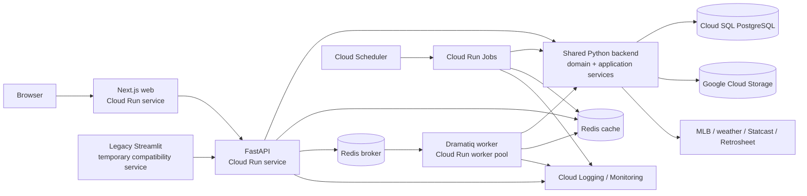
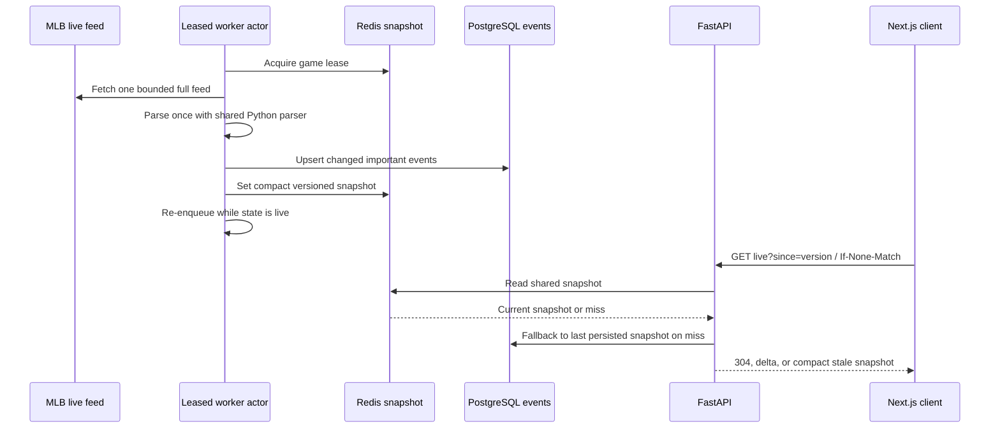

# Target architecture and strangler migration plan

Status: proposed and ready for approval. No implementation, deployment, or data cutover has occurred.

## Goals and non-goals

The target is a stateless, horizontally scalable All Rise Analytics platform that preserves the current product and visual identity while separating UI, API, business rules, persistence, cache, and background execution.

This plan does not authorize deleting the Streamlit app, changing the production deployment, rebuilding the database, running a backfill, or redesigning the experience. Each new slice must prove parity before traffic moves.

## Architecture decisions

1. **Use a strangler migration.** The current root `app.py` remains runnable until all acceptance flows pass on the replacement.
2. **Keep one Python source of truth for analytics.** FastAPI, the worker, jobs, and the temporary Streamlit adapter import a shared backend package. TypeScript consumes typed results; it does not reimplement grading or projections.
3. **Use PostgreSQL as the durable serving store.** SQLite is permitted only as a read-only migration source and local legacy fallback. Production settings reject SQLite.
4. **Use Redis for cache and coordination, not truth.** Cache loss must degrade to PostgreSQL or a persisted snapshot without blanking the product.
5. **Use GCS for immutable/raw artifacts.** Raw imports, migration extracts, and cold analytical files belong in object storage, not GitHub releases or a web container filesystem.
6. **Use Dramatiq with Redis for queued Python work.** Its actors stay thin and call shared application services. Cloud Run Jobs execute scheduled and finite batch work from the same task library. This choice is simpler than Celery for the present workload and still provides retries/middleware; it should be re-evaluated with a representative queue test before production.
7. **Use controlled polling for live games.** A worker-owned, lease-protected poll produces one shared snapshot per active game. Clients poll a compact API response with ETags/change tokens. SSE can be added later without changing the snapshot contract.
8. **Use App Router and generated contracts.** Next.js routes own URL state. TypeScript types/API clients are generated from FastAPI OpenAPI into `packages/shared-types`.
9. **Represent identifiers as strings at the API boundary.** Most Retrosheet synthetic IDs exceed JavaScript's safe integer range. The new canonical game ID is a string such as `mlb:746123` or `retro:DET202304181`; MLB and Retrosheet IDs remain separately queryable.
10. **Do not migrate schema at service startup.** Alembic runs as a deliberate release/job step before a revision receives traffic.

## Target architecture



### Serving flow

1. Next.js restores page/filter state from a canonical URL.
2. It requests a compact typed FastAPI resource.
3. FastAPI validates input and checks a versioned Redis key.
4. On a cache miss, the service reads PostgreSQL. Ordinary request paths do not run backfills, full summary calculations, or broad provider fan-out.
5. Responses include `request_id`, `as_of`, `data_version`, cache status, and pagination metadata where applicable.
6. Writes/precomputation are queued or performed by an authorized job. The worker commits facts/checkpoints before invalidating or warming cache keys.

## Proposed folder structure

```text
.
|-- apps/
|   |-- web/
|   |   |-- Dockerfile
|   |   |-- package.json
|   |   |-- next.config.ts
|   |   |-- src/app/                  # App Router pages/layouts/errors/loading
|   |   |-- src/components/           # product-specific React components
|   |   |-- src/lib/api/              # generated-client adapter, query keys
|   |   |-- src/styles/               # audited All Rise tokens and globals
|   |   `-- public/                   # approved static assets
|   |-- api/
|   |   |-- Dockerfile
|   |   |-- pyproject.toml
|   |   `-- src/all_rise_api/
|   |       |-- main.py
|   |       |-- dependencies.py
|   |       |-- api/v1/routes/
|   |       |-- middleware/
|   |       `-- schemas/
|   `-- streamlit-legacy/
|       |-- Dockerfile
|       |-- app.py
|       |-- components/
|       `-- .streamlit/config.toml
|-- packages/
|   |-- backend/
|   |   |-- pyproject.toml
|   |   |-- alembic.ini
|   |   |-- alembic/versions/
|   |   `-- src/all_rise/
|   |       |-- config.py
|   |       |-- domain/               # pure calculations and entities
|   |       |-- application/          # use cases, transaction boundaries
|   |       |-- repositories/         # protocols + SQLAlchemy implementations
|   |       |-- models/               # SQLAlchemy tables
|   |       |-- clients/              # MLB/weather/GCS clients
|   |       |-- cache/                # Redis keys/serialization/fallbacks
|   |       `-- observability/
|   |-- shared-types/                  # generated OpenAPI TypeScript contracts
|   `-- ui/                            # shared React primitives/tokens
|-- services/
|   `-- worker/
|       |-- Dockerfile
|       |-- pyproject.toml
|       `-- src/all_rise_worker/
|           |-- broker.py
|           |-- actors/
|           `-- commands/              # finite commands also used by Jobs
|-- infra/
|   |-- docker/
|   |-- cloud-run/
|   |   |-- services/
|   |   |-- worker-pool/
|   |   |-- jobs/
|   |   `-- README.md
|   `-- terraform/                     # optional after manual plan is proven
|-- scripts/
|   |-- data/                           # migration/seed/validation entry points
|   `-- dev/
|-- tests/
|   |-- unit/
|   |-- integration/
|   |-- contract/
|   |-- worker/
|   |-- migration/
|   `-- e2e/
|-- docs/
|   |-- architecture/
|   `-- runbooks/
|-- compose.yaml
|-- .env.example
|-- Makefile                            # optional cross-platform wrappers
`-- app.py                              # temporary compatibility launcher
```

The shared backend package is intentional. Putting domain/repository/service code under `apps/api` would force the worker and legacy app to depend on the HTTP application. The API and worker should instead be thin delivery mechanisms around the same use cases.

## Boundary rules

### API routing

- Parses and validates HTTP inputs.
- Invokes one application use case.
- Maps typed results to compact response schemas.
- Does not contain SQL, provider parsing, grading, DataFrame calculations, or task bodies.

### Domain

- Contains deterministic calculations, identifiers, grades, projections, and parsing of already-fetched payloads.
- Has no Streamlit, FastAPI, SQLAlchemy session, Redis, HTTP, filesystem, or environment imports.
- Uses plain dataclasses/value objects where practical; Pydantic is reserved for boundaries.

### Application services

- Orchestrate repository/client/cache calls and define transaction boundaries.
- Take repository/client protocols as dependencies.
- Decide freshness and fallback policy.
- Are callable by API, worker, jobs, and compatibility adapters.

### Repositories

- Own SQLAlchemy statements, eager loading, pagination, bulk operations, and row-to-domain mapping.
- Return bounded projections rather than raw ORM graphs or whole DataFrames.
- Expose batch methods for every list-oriented use case.

### Clients

- Centralize base URLs, headers, timeouts, retry budgets, redaction, timing, and provider error mapping.
- Return provider DTOs or parsed domain inputs; never write the database implicitly.

### Cache

- Owns key construction, TTLs, serialization, hit/miss/degraded telemetry, and stampede locks.
- Uses JSON/MessagePack-compatible typed data, never pickle.

### Frontend

- Owns rendering, accessibility, interaction, optimistic display state, and URL state.
- Never implements grades, shrinkage, bullpen availability, streak calculations, or provider parsing.

## File disposition plan

No file is deleted in the initial restructuring phase.

| Current path | Near-term action | Eventual destination/status |
|---|---|---|
| `app.py` | Keep as the supported local launcher | Move implementation to `apps/streamlit-legacy/app.py`; retain a thin root launcher until retirement |
| `components/research_table/` | Keep unchanged | Move under legacy app; replace behavior with React components, then deprecate |
| `.streamlit/config.toml` | Keep root-compatible | Move/copy to legacy service after path verification |
| `src/ui/` | Keep imports working | Move to legacy app; deprecate after HVP parity |
| `src/matchup_grading.py` | Extract first with golden tests | `packages/backend/.../domain/matchup_grading.py`; old path becomes compatibility re-export |
| `src/scoring.py` | Extract pure functions | Shared domain package; compatibility re-export |
| `src/pitch_analysis.py` | Retain and type | Shared domain package |
| `src/bullpen_projection.py` | Retain and type | Shared domain package |
| `src/recent_form.py` | Split calculation from HTML | Calculation to domain; HTML stays legacy, then React |
| `src/team_mappings.py` | Consolidate all mappings | Shared domain/reference data |
| `src/time_utils.py` | Retain | Shared config/time utility |
| `src/live_game.py` | Split parser/calculations from HTTP calls | Domain parser + MLB client + live application service |
| `src/weather.py` | Split calculations from providers | Domain weather + provider clients |
| `src/matchups.py` | Convert DataFrame orchestration gradually | Application matchup service |
| `src/bvp_research.py` | Remove repository writes from request use case | Application research service + worker projection task |
| `src/stat_data.py` | Split clients/cache/repository facades | MLB client + application services; module dictionary deprecated |
| `src/api_client.py` | Preserve timeout/retry intent | Typed `httpx` client factory with metrics/redaction |
| `src/database.py` | Freeze feature growth; add read-only adapter | Legacy SQLite repository only; excluded from production image, then deprecated |
| `src/background.py` | Stop adding callers | Deprecated after equivalent actors/jobs exist |
| `refresh_database.py` | Keep CLI behavior | Thin wrapper over shared job command |
| `refresh_nightly.py` | Keep until scheduler cutover | Thin wrapper, then legacy runbook only |
| `backfill_database.py` | Preserve parser fixtures | Parser/import service + finite Cloud Run Job command |
| `refresh_weather_cache.py` | Keep until weather table/job live | Worker/job command, then deprecate release JSON |
| `scripts/*pitch_data.py` | Preserve separate dependency/runtime | Worker/job commands with corrected window reconciliation |
| `tests/` | Keep all characterization tests | Reorganize only alongside moved code; never lose baseline coverage |
| `.github/workflows/refresh-*.yml` | Retain as production path | Disable only after Cloud Jobs parity; keep rollback history before deletion |
| `data/mlb.db` and precomputed files | Never commit or copy into new images | Read-only migration input; production replaced by PostgreSQL/Redis/GCS |

Compatibility modules should import/re-export moved functions, not maintain copied implementations. Any temporary duplication gets an owner and deletion condition.

## FastAPI contract plan

### Platform endpoints

| Method and path | Purpose | Readiness behavior |
|---|---|---|
| `GET /health` | Process liveness; no dependency calls | Always bounded; 200 if process is alive |
| `GET /ready` | Schema head and PostgreSQL reachability | 503 when DB/schema is unusable; Redis loss reports degraded but remains ready |
| `GET /version` | Build SHA, API version, schema revision | No secrets or internal paths |
| `GET /api/v1/data-status` | Per-source watermark, freshness, last successful/failed run | Bounded indexed read |

### Product endpoints

| Resource | Proposed contract notes |
|---|---|
| `GET /api/v1/games?date=YYYY-MM-DD&limit=&cursor=` | Compact schedule cards; filter status/team; cache by date/version |
| `GET /api/v1/games/{game_id}` | Game identity/status/teams/venue; string identifier |
| `GET /api/v1/games/{game_id}/live?since=` | Bounded snapshot/delta with ETag and stale flag |
| `GET /api/v1/games/{game_id}/box-score` | Typed team/batter/pitcher rows |
| `GET /api/v1/games/{game_id}/lineups` | Current/projected lineups only |
| `GET /api/v1/games/{game_id}/weather` | Current/final snapshot and adjustment explanation |
| `GET /api/v1/games/{game_id}/bullpen?batter_id=` | Precomputed projected bullpen; never compute broad history inline |
| `GET /api/v1/players?query=&team_id=&group=&limit=&cursor=` | Player directory, bounded search |
| `GET /api/v1/players/{player_id}` | Profile/current team/position |
| `GET /api/v1/players/{player_id}/game-log?season=&group=&limit=&cursor=` | Paginated game log |
| `GET /api/v1/players/{player_id}/pitch-types?season=&pitcher_hand=` | Compact pitch summary rows |
| `GET /api/v1/teams/{team_id}/roster?date=` | Persisted roster snapshot |
| `GET /api/v1/matchups/batter-pitcher?date=&game_id=&batter_id=&pitcher_id=` | Precomputed BvP slate/pair results |
| `GET /api/v1/matchups/batter-hand?date=&game_id=&batter_id=` | Persisted hand splits + grade |
| `GET /api/v1/matchups/pitcher-strikeouts?date=&game_id=&pitcher_id=` | Pitcher/opponent results |
| `GET /api/v1/matchups/bullpen?game_id=&batter_id=` | Alias/resource for research navigation |
| `GET /api/v1/research/batter-pitcher?batter_id=&pitcher_id=&season=` | Summary plus bounded links/counts; large logs paginated separately |
| `GET /api/v1/pitches/analysis?batter_id=&pitcher_id=&season=&limit=&cursor=` | Exact pitch summaries/events with explicit fields and bounds |
| `GET /api/v1/streaks?date=&group=&metric=&limit=&cursor=` | Precomputed batter/pitcher/team streaks |
| `GET /api/v1/stats/players?season=&group=&limit=&cursor=` | Player leaderboard |
| `GET /api/v1/stats/teams?season=&group=&mode=` | Team leaderboard |
| `GET /api/v1/injuries?date=&team_id=` | Persisted injury context |
| `GET /api/v1/methodology` | Versioned methodology/glossary content |

### Contract rules

- Pydantic v2 request/response models and strict query constraints.
- `limit` defaults are small and have a hard maximum; use cursor pagination for stable logs/events.
- API IDs are strings/brand types. Never emit Retrosheet synthetic `game_pk` as a JavaScript number.
- Responses use `{data, meta}` where `meta` contains request ID, data version, source time, stale status, and pagination. Errors use one safe structure such as `{error: {code, message, request_id, details?}}`.
- Raw database/provider errors are logged with redaction and mapped to stable codes.
- Conditional GET/ETag for live, games, weather, and immutable historical resources.
- FastAPI lifespan creates/disposes DB, Redis, and HTTP pools. Startup does not run a backfill or migration.
- CORS is an environment-specific allowlist; wildcard origins are forbidden in production.
- Middleware supplies validated request IDs, structured timing, body-size limits, secure headers, slow-request logs, and a Redis-backed rate-limit interface.
- OpenAPI generation is a CI contract. The generated TypeScript package must be clean after regeneration.

## PostgreSQL migration plan

### Target model

Core normalized tables:

- `teams`, `venues`, `players`, `player_team_memberships`
- `games` with an internal key, canonical `source_game_id`, nullable `mlb_game_pk`, nullable `retrosheet_game_id`, and source/version columns
- `roster_snapshots`, `roster_entries`
- `batter_pitcher_game_logs`, `batter_pitcher_summaries` (career semantic explicit)
- `pitcher_game_logs`, `pitcher_season_summaries`
- `pitch_types`, `pitch_events`, `plate_appearance_sequences`
- `batter_pitch_type_summaries`, `pitcher_pitch_type_summaries`, `bvp_pitch_type_summaries`
- `bullpen_projection_runs`, `bullpen_projection_items`
- `weather_snapshots`
- `live_game_snapshots`, `live_game_events`, `live_game_contacts`
- `streak_summaries`
- `refresh_runs`, `refresh_run_items`, `processing_checkpoints`, `data_source_status`
- `source_artifacts` with GCS URI, generation, checksum, size, fetch time, and source version

Use `DATE`, UTC `TIMESTAMPTZ`, booleans, numeric checks, foreign keys, explicit source-observed timestamps, and normalized numeric workload/range columns. JSONB is reserved for bounded provider residuals with a retention policy, not core facts.

### Identifier migration

The existing Retrosheet synthetic game key is a signed 63-bit hash; 49,441 of 49,486 historical IDs exceed JavaScript's safe integer magnitude. The migration will:

- retain the legacy key in an audit column only;
- create canonical string IDs (`mlb:<gamePk>` or `retro:<retrosheetGameId>`);
- preserve `mlb_game_pk` as `BIGINT` for provider joins;
- preserve `retrosheet_game_id` as text;
- return string IDs through OpenAPI/TypeScript.

### Migration sequence

1. Pin/freeze a read-only SQLite snapshot and checkpoint its WAL.
2. Record SHA-256, byte size, `quick_check`, table/index inventory, row counts, min/max dates, source counts, and orphan checks.
3. Apply Alembic to an empty PostgreSQL database and verify it reaches head.
4. Export SQLite in bounded `fetchmany()` chunks; do not load the complete database into pandas.
5. Write immutable, checksummed extracts to GCS and record artifact metadata.
6. Load staging tables with PostgreSQL `COPY`.
7. Transform text dates/timestamps, canonical IDs, teams, and normalized fields.
8. Validate row counts, uniqueness, constraints, source/date ranges, and sampled calculations.
9. Rebuild derived summaries from facts, not copied summaries alone, and compare with SQLite golden samples.
10. Run an incremental tail for games completed after the snapshot.
11. Enable shadow reads in the API and compare responses without serving them to users.
12. Switch one endpoint/page behind a feature flag. Keep the SQLite adapter read-only and available for rollback.
13. Reject SQLite URLs when `APP_ENV=production` after all production reads have moved.

### Correct ingestion semantics

- Retrosheet replacement is scoped to `(source='retrosheet', season)` so it cannot delete same-season StatsAPI/Statcast records.
- Chadwick commits and Retrosheet archives are pinned and checksummed.
- Statcast correction windows reconcile inserts, updates, and deletions in facts, then recompute only affected summary keys from authoritative `pitch_events`.
- Facts and processing checkpoints commit atomically.
- Summary generations are built/validated before an active-version pointer changes.
- A failed run never replaces the previous valid generation.

### Index plan

Start with access-pattern indexes and prove each with `EXPLAIN (ANALYZE, BUFFERS)`:

- `games(game_date)` and home/away team plus date
- unique `games(source_game_id)`; unique nullable provider IDs
- BvP logs `(batter_id, pitcher_id, game_date DESC, game_id)`
- batter streak `(season, batter_id, game_date DESC, game_id)`
- pitcher history `(season, pitcher_id, game_date DESC, game_id)`
- pitcher/opponent `(pitcher_id, opponent_team_id, game_date DESC)`
- pitch events by game/at-bat/pitch, batter/pitcher/date, pitcher/type/date, batter/type/date
- live/weather `(game_id, observed_at DESC)`
- refresh runs `(status, created_at DESC)` and checkpoints `(source, scope)`
- BRIN on large date-ordered pitch-event partitions when measurements support it

Do not copy SQLite's duplicate/prefix indexes automatically.

### Retention

| Data | Proposed retention |
|---|---|
| Games, players, normalized historical logs, final summaries | Indefinite |
| Raw Retrosheet/Chadwick/Statcast source artifacts | Indefinite in lifecycle-managed GCS; older generations move to colder class |
| Pitch events | Current plus at least two seasons in hot PostgreSQL; older yearly partitions only archive after transparent-query design is proven |
| Live Redis snapshots | Seconds to minutes |
| Raw live snapshots | 7-30 days in GCS/PostgreSQL depending debugging value |
| Normalized final plays/contact/scoring events | Indefinite where product features use history |
| Weather snapshots | Through final game plus historical seasons used in analysis; raw provider payloads 30 days |
| Detailed task attempts/log records | 90 days; compact run/freshness audit retained longer |
| Local production files | None |

Retention values become configuration/policy and require product approval before deletion jobs are enabled.

## Redis plan

Use separate production endpoints for cache and queue when practical (`REDIS_CACHE_URL`, `REDIS_BROKER_URL`); local Compose may point both to one Redis. Logical database numbers are not sufficient isolation from eviction or memory exhaustion.

| Key pattern | Typical TTL/freshness |
|---|---|
| `games:{date}:v{version}` | 30 seconds on current date; 15 minutes or immutable for past/final dates |
| `game:{game_id}:v{version}` | 15 seconds live; one hour final |
| `player:{player_id}:v{version}` | 15 minutes |
| `roster:{team_id}:{date}:v{version}` | 10 minutes |
| `probable-pitchers:{date}:v{version}` | 5 minutes |
| `weather:{game_id}:v{version}` | 10 minutes pregame; longer after final |
| `live:{game_id}` | 2-5 seconds, refreshed by one worker lease |
| `bvp:{batter_id}:{pitcher_id}:v{version}` | 1 hour |
| `batter-hand:{batter_id}:{hand}:{season}:v{version}` | 1 hour |
| `bullpen:{game_id}:{batter_id}:v{version}` | 5-15 minutes |
| `pitch-summary:{scope}:v{version}` | 1 hour current; longer historical |
| common mappings/lookups | 24 hours with a version |

Rules:

- Versions come from `data_source_status`/summary generations, never file mtime.
- TTL plus versioning is the default invalidation strategy; workers warm only popular keys after a successful commit.
- A short `SET NX` lease prevents stampedes. PostgreSQL advisory locks remain the correctness fallback for mutations.
- Negative cache entries have short TTLs and never hide upstream recovery.
- Redis loss fails open to PostgreSQL for ordinary reads. The live endpoint returns the last persisted snapshot with `stale=true`; it does not unleash one upstream request per user.
- No module-level production dictionary or pickle fallback.
- Metrics record hit, miss, age, serialization failure, lock wait, and degraded fallback.

Google recommends Direct VPC egress for Cloud Run-to-Memorystore connectivity because it removes connector instances and can reduce latency/cost: [official Memorystore guidance](https://docs.cloud.google.com/memorystore/docs/redis/connect-redis-instance-cloud-run).

## Background work plan

### Runtime split

- **Cloud Run Jobs:** finite scheduled/batch work such as nightly final-game refresh, weather/roster snapshots, Statcast windows, historical imports, cleanup, validation, and full reconciliation.
- **Dramatiq worker pool:** queued per-game/per-team fan-out, cache warming, projection generation, and leased live polling.
- **PostgreSQL:** durable run/item/checkpoint authority.
- **Redis broker:** delivery and retry scheduling; not the only status record.

Cloud Run now distinguishes HTTP services, finite jobs, and continuous worker pools. Worker pools have no endpoint and do not autoscale, so the initial deployment uses one measured instance and an explicit manual/own-autoscaler policy: [Cloud Run resource overview](https://docs.cloud.google.com/run/docs/overview/what-is-cloud-run), [worker-pool deployment](https://docs.cloud.google.com/run/docs/deploy-worker-pools).

### Task inventory

| Task/command | Trigger | Idempotency scope |
|---|---|---|
| `refresh_schedule(date)` | Scheduler and manual | source/date/version |
| `refresh_probable_pitchers(date)` | Schedule chain | date/provider version |
| `refresh_roster(team_id, date)` | Fan-out | team/date/version |
| `refresh_injuries(team_id, date)` | Fan-out | team/date/version |
| `process_completed_game(game_id, source_version)` | Schedule discovery | game/source version |
| `refresh_weather(date_range)` | Every 10-15 minutes around games | venue/date/provider version |
| `poll_live_game(game_id)` | Delayed actor while live | game/feed timestamp; leased |
| `persist_live_snapshot(game_id, version)` | Live actor | game/snapshot version |
| `refresh_statcast_window(start, end)` | Daily job/manual | complete window/source artifact |
| `import_retrosheet_season(season, artifact_generation)` | Manual job | source/season/generation |
| `rebuild_bvp_keys(keys, generation)` | Ingest chain | affected keys/generation |
| `rebuild_pitch_type_keys(keys, generation)` | Ingest chain | affected keys/generation |
| `generate_bullpen_projection(game_id, team_id, version)` | Schedule/roster update | game/team/data version |
| `refresh_streak_summaries(season, through_date)` | Ingest chain | season/date/version |
| `validate_data_source(source, watermark)` | Every run | source/watermark |
| `cleanup_retention(policy_version)` | Weekly job | policy/window |
| `warm_cache(data_version)` | Post-commit | namespace/version |

Every task has a unique idempotency key, bounded attempts, exponential backoff with jitter, per-item error records, a heartbeat, stale-task recovery, and a dead-letter state. A failed team/game does not stop peers. Overall jobs fail when error/quality thresholds are exceeded and never publish a degraded generation as successful.

Cloud Scheduler invokes jobs with an IAM service account and an authenticated Run API call, following [Google's scheduled Cloud Run Jobs pattern](https://docs.cloud.google.com/run/docs/execute/jobs-on-schedule).

## Next.js migration plan

### Visual continuity

First extract a documented token set from the current CSS:

- navy primary, gray page background, white analytical panels;
- Manrope body text and Bebas Neue display use only where currently intentional;
- team accent mapping;
- grade names/colors/treatments;
- table density, borders, sticky headers, headshots/logos;
- spacing, breakpoints, loading/empty/error states.

Visual regression snapshots should compare representative current and React pages at desktop and mobile widths. The goal is not pixel-copying Streamlit internals; it is preserving recognizably All Rise behavior and tone.

### Route and URL-state plan

| Current area | Next route | Canonical state |
|---|---|---|
| Default/Games | `/games?date=&team=&status=` | date/team/status |
| Game Center | `/games/[gameId]?tab=live|stats|box-score` | game + tab |
| Player profile | `/players/[playerId]?season=&group=&from=` | player/season/group/return |
| Matchups | `/matchups?date=&game=&batter=&pitcher=&type=` | all filters |
| Advanced HVP | `/research/batter-vs-pitcher?batter=&pitcher=&game=&mode=&date=` | all research IDs/mode |
| Projected bullpen | `/matchups/bullpen?game=&batter=&team=` | game/batter/team |
| Streaks | `/streaks?date=&group=&metric=&game=` | full selection |
| Player Stats | `/stats/players?season=&group=&sort=&query=` | leaderboard state |
| Team Stats | `/stats/teams?season=&group=&mode=&sort=` | leaderboard state |
| Weather | `/weather?date=&game=` | date/game |
| Details | `/methodology` | optional anchored section |
| New shell home | `/` | links/status only; does not replace Games behavior |

Use server components for initial data and static shells; use client components for filters, tables, dialogs, live polling, and charts. TanStack Query is preferred for bounded client refresh/retry/cache behavior. Search parameters are parsed/validated in one route-state module.

### Page order

1. Methodology and shared shell/tokens.
2. Games slate and weather cards.
3. Player/team leaderboards and profiles.
4. Hitter-pitcher, hand, and pitcher-K matchups.
5. Advanced HVP and projected bullpen.
6. Streaks.
7. Live Game Center.

Each page can link to the legacy equivalent while flagged off. Feature flags select the authoritative page without deleting the old one.

Required UI states: loading skeleton, empty result, stale data, safe retry, external-source degradation, validation error, and accessible keyboard/focus behavior. No critical navigation state may live only in React memory.

## Live-game plan



The compact snapshot separates score, inning/count/outs, bases, current batter, current pitcher, current pitch, recent plays, contact data, lineups, box score version, and weather version. The default response includes only recent bounded plays; older plays use pagination.

The worker stops re-enqueueing after a final state and performs a final canonical persistence/cache update. One game lease means viewer count does not increase MLB traffic. If the worker/Redis is unavailable, the API serves the last persisted snapshot with an age/stale indicator; temporary failure never blanks the UI.

Start with five-second conditional polling because it is simple and Cloud Run friendly. SSE is a later transport optimization; the API snapshot/delta schema remains unchanged.

## Local development plan

Root `compose.yaml` will define:

| Service | Default local port | Notes |
|---|---:|---|
| `postgres` | 5432 | Named volume, readiness health check |
| `redis` | 6379 | Cache and broker in local development |
| `migrate` | one-shot | `alembic upgrade head` dependency |
| `api` | 8000 | FastAPI reload, depends on migrate/Postgres/Redis health |
| `worker` | none | Dramatiq reload/restart development process |
| `web` | 3000 | Next.js dev server |
| `streamlit-legacy` | 8501 | Optional Compose profile; current root path preserved |

`docker compose up --build` starts the new stack. `docker compose --profile legacy up --build` includes Streamlit. Source mounts are limited to development; images copy locked dependencies.

`.env.example` contains names and safe local defaults only:

```text
APP_ENV
LOG_LEVEL
APP_TIMEZONE
DATABASE_URL
REDIS_URL
REDIS_CACHE_URL
REDIS_BROKER_URL
MLB_API_BASE_URL
WEATHER_API_BASE_URL
GCS_BUCKET
API_BASE_URL
NEXT_PUBLIC_API_BASE_URL
CORS_ALLOWED_ORIGINS
DB_POOL_SIZE
DB_MAX_OVERFLOW
```

Seed command loads a small deterministic, non-private fixture sufficient for games, profiles, BvP, pitch types, bullpen, streaks, weather, and live replay. It never downloads Statcast or imports the full historical database. Explicit separate commands perform migration extraction or backfill.

## Cloud Run deployment plan

### Resources

| Component | Cloud resource | Starting recommendation, then load-test |
|---|---|---|
| Next.js | Cloud Run service | 1 vCPU, 512 MiB-1 GiB, concurrency 40-80, 30 s timeout, min 0 or 1 |
| FastAPI | Cloud Run service | 1-2 vCPU, 1-2 GiB, concurrency about 20, 30 s timeout, min 1 in-season, bounded max instances |
| Legacy Streamlit | Temporary Cloud Run service | Internal/limited access, 1 vCPU, ~2 GiB, concurrency 1-4, no production SQLite writes |
| Dramatiq | Cloud Run worker pool | 2 vCPU, 2-4 GiB, one measured instance initially; manual/own autoscaling |
| Normal scheduled jobs | Cloud Run Jobs | 1-2 vCPU, 1-4 GiB, task-specific timeout/retry |
| Statcast/backfill jobs | Cloud Run Jobs | 2-4 vCPU, 4-8 GiB, bounded partitions and explicit checkpointing |
| PostgreSQL | Cloud SQL for PostgreSQL | HA/PITR for production; size by measured storage/IOPS/connections |
| Cache/broker | Memorystore Redis | Direct VPC egress; separate cache/broker endpoints where practical |
| Artifacts | GCS | Versioning, lifecycle, retention, least-privilege service accounts |

These are hypotheses, not hard-coded deployment values. Load tests, Cloud SQL connection limits, queue lag, and memory measurements set final values. API pool defaults should be small (for example 5 plus bounded overflow) and the sum across maximum instances must fit the database budget.

Google documents Cloud Run health checks, including startup/liveness/readiness probes: [health-check guidance](https://docs.cloud.google.com/run/docs/configuring/healthchecks). Configure API startup/readiness endpoints and avoid provider calls in probes. Cloud SQL connectivity follows [the Cloud Run PostgreSQL guidance](https://docs.cloud.google.com/sql/docs/postgres/connect-run).

### Release flow

1. CI installs locked Python/Node dependencies and runs format, lint, type, unit, integration, contract, frontend, migration, and container scans.
2. Build service images once; publish immutable Artifact Registry digests and an SBOM.
3. Run Alembic migration job against staging, then production with backup/rollback checks.
4. Deploy API/web/worker revisions using environment references and least-privilege service accounts.
5. Run smoke/acceptance tests on a no-traffic or tagged revision.
6. Shift a small traffic percentage or enable one page flag.
7. Watch latency/errors/data freshness/queue lag, then promote or roll back.

No project ID, region, URL, credential, port, or secret is embedded in source manifests. Cloud Run service identities receive only required Cloud SQL, Redis network, GCS, logging, and secret access.

Google recommends Secret Manager for Cloud Run secrets; environment-injected secrets should be pinned to a version, while mounted volumes support latest-version rotation: [official secret guidance](https://docs.cloud.google.com/run/docs/configuring/services/secrets).

## Security plan

- Pydantic validation, bounded query parameters, string-branded IDs, and parameterized SQLAlchemy statements.
- Production CORS allowlist and same-origin frontend where possible.
- Rate-limit middleware backed by Redis with a fail-safe policy for public reads.
- Secure headers on Next.js and API: CSP tailored to approved MLB/font assets, HSTS at the edge, nosniff, referrer policy, frame restrictions, and permissions policy.
- React escaping by default; narrowly reviewed rich HTML only. Remove wildcard component messaging and parent-DOM mutation.
- HTTP client connect/read/write/pool timeouts, exponential jitter, retry caps, response-size limits, and URL/query redaction.
- Secret Manager references, service-account least privilege, no secrets in logs/config/repo.
- Locked dependencies with hashes where supported, SHA-pinned actions, secret scanning, SAST, dependency audit, SBOM, license and container scanning.
- Production debug disabled and OpenAPI exposure configurable if the threat model requires it.
- GCS artifact size/checksum/schema validation before processing; no pickle.
- Internal job/administrative endpoints use IAM/service authentication and are never public task triggers.
- A production configuration test fails startup/build when the database scheme is SQLite or a secret-like value is present in public frontend variables.

## Observability plan

Emit structured JSON to stdout so Cloud Logging captures it. Google describes structured payload fields and Cloud Run logging behavior in [Cloud Logging structured logging](https://docs.cloud.google.com/logging/docs/structured-logging) and [Cloud Run logging](https://docs.cloud.google.com/run/docs/logging).

Required fields:

- timestamp, severity, service, environment, build SHA;
- event name, request/task/run ID, route/task, game/player/team/source IDs;
- status/error code, duration, DB duration, provider duration/status/attempts;
- cache result/key namespace/age, data version/as-of/stale;
- rows read/written, artifact generation/checksum, task attempt;
- memory RSS, queue lag, worker heartbeat where relevant.

Thresholds start with slow request at 500 ms and slow DB operation at 250 ms, then tune from traces. Never log response bodies, secrets, signed URLs, or unrestricted query strings.

Operational endpoints and tables expose liveness, readiness, version, source freshness, current summary generation, last successful/failed runs, and checkpoint lag. Alerts cover stale schedules/stats/weather/live data, failed jobs, dead letters, upstream error rate, Redis degradation, DB pool saturation, slow requests/queries, queue lag, and memory growth.

## Test plan

### Test layers

| Layer | Required coverage |
|---|---|
| Characterization | Preserve all 85 tests; add golden outputs from representative legacy flows |
| Domain unit | Grading, pitch calculations, bullpen, streaks, weather, live parsers, small-sample adjustments |
| Repository | Real ephemeral PostgreSQL, constraints, pagination, batch query counts, transactions |
| Migration | Blank-to-head, legacy snapshot import, count/checksum/orphan/date/source reconciliation |
| Cache | Hit/miss/version/TTL/stampede/serialization and Redis-unavailable fallback |
| Worker/job | Idempotency, retry, lock, heartbeat, partial failure, checkpoint, dead letter |
| API | ASGI endpoint/schema/error/CORS/rate-limit/timeout tests with dependency overrides |
| Contract | OpenAPI snapshot and generated TypeScript drift check |
| Frontend | Vitest/React Testing Library for components, state, errors, API client |
| E2E | Playwright desktop/mobile for core routes and refresh/back behavior |
| Load/resilience | k6/Locust for cached/DB/live/matchup paths plus dependency fault injection |
| Security/supply chain | SAST, dependency audit, secrets, SBOM, containers, CSP/injection/log redaction |

All automated tests use fixtures or recorded/sanitized provider payloads. They do not require live MLB/weather services.

### Data correctness gates

- Ingesting one combined Statcast window must equal multiple windows.
- Reprocessing the same game/task twice leaves counts/results unchanged.
- A correction window reconciles deleted source pitches.
- Retrosheet replacement preserves same-season StatsAPI/Statcast facts.
- A failed summary build leaves the previous active generation visible.
- Sampled PostgreSQL calculations match legacy SQLite/domain goldens by stable ID.
- API repository tests assert maximum query counts to catch ORM N+1 behavior.

### Acceptance flow matrix

| Flow | Required automated proof |
|---|---|
| Load today's games | Cached and cold DB response; stale/source indicators |
| Open a game | Canonical URL and typed detail/box score |
| Open a player | Refresh retains season/group/return state |
| BvP research | Golden stats/grade/log pagination |
| Exact pitch analytics | Multi-window-correct summaries and bounded events |
| Projected bullpen | Golden availability/composite; no request-time write |
| Streaks | Precomputed parity for batter/pitcher/team |
| Live game | Recorded feed sequence, one upstream poll/game, delta/ETag/final stop |
| Browser refresh | All critical URL state restored |
| External API failure | Last valid data or safe degraded state, no blank page |
| Redis unavailable | PostgreSQL/persisted fallback, bounded latency, no request storm |
| Delayed database | Timeout, safe error, readiness behavior, no raw exception |
| Two app instances | Same PostgreSQL/Redis state and stable results |
| Worker during traffic | Reads remain consistent while facts/generation update |
| Production runtime | Image/config contains no SQLite serving dependency |

Performance targets are enforced against representative volume: cached reads under 250 ms where realistic, ordinary DB reads under 500 ms, lightweight live responses, bounded pages, and no full datasets in a per-user request.

## Phased strangler plan

Every phase starts with a written objective/files/risks/preservation note and ends with tests, formatting/linting, type checks, import checks, and applicable Docker builds. Failure to pass the exit gate stops the next phase.

### Phase 0 - Audit and architecture gate (complete)

- **Objective:** establish evidence, boundaries, risks, and the sequence before structural edits.
- **Files changed:** documentation in `docs/architecture/` only.
- **Risk:** documentation can miss runtime behavior.
- **Preservation:** no runtime, data, workflow, or deployment changes.
- **Exit gate:** repository/UI/data audit, diagrams, plans, compile pass, 85 tests pass.

### Phase 1 - Non-disruptive monorepo scaffold

- **Objective:** create folders, packaging, locked tooling, Compose skeleton, and compatibility conventions.
- **Expected files:** root workspace/config files; `apps/*`, `packages/backend`, `services/worker`, `infra`, empty service health shells.
- **Risk:** import/path breakage, especially `Path(__file__)` references and custom component paths.
- **Preservation:** root `app.py`, `src`, `components`, data paths, and current launch command remain authoritative. Do not move Streamlit yet.
- **Exit gate:** legacy 85 tests/imports/browser smoke pass; API/web placeholder lint/type/tests; Compose starts Postgres/Redis/health shells.

### Phase 2 - Shared backend domain extraction

- **Objective:** move pure grading, scoring, pitch, bullpen, weather, live parsing, streak, and stats calculations behind typed interfaces.
- **Expected files:** `packages/backend/.../domain`; compatibility re-exports in current `src`; golden characterization fixtures/tests.
- **Risk:** subtle numeric, null, naming, or DataFrame behavior changes.
- **Preservation:** Streamlit continues importing old paths; compatibility tests compare old/new outputs exactly.
- **Exit gate:** domain has no UI/I/O imports; golden tests, mypy/pyright, lint, full legacy suite pass.

### Phase 3 - FastAPI and repository contracts

- **Objective:** create production middleware/config/lifespan/error contracts and read-only repository protocols.
- **Expected files:** `apps/api`, backend application services/protocols, dev-only SQLite adapter, OpenAPI contract tests.
- **Risk:** accidentally exposing giant frames or raw errors; coupling API to SQLite.
- **Preservation:** endpoints begin shadow-only; Streamlit still serves users. SQLite adapter is explicitly non-production/read-only.
- **Exit gate:** health/ready/version/data-status, typed bounded routes, error/failure tests, no production SQLite config, API image build.

### Phase 4 - PostgreSQL and Alembic shadow migration

- **Objective:** implement normalized schema, migrations, bulk extraction/load, repository queries, and parity validation.
- **Expected files:** SQLAlchemy models, Alembic revisions, PostgreSQL repositories, migration/validation scripts, GCS artifact metadata.
- **Risk:** source-ID overflow, schema drift, date/time conversion, missing/duplicate facts, long migration.
- **Preservation:** freeze/copy SQLite read-only; no destructive source changes; API compares shadow results before serving.
- **Exit gate:** blank-to-head and snapshot migration tests, counts/checksums/orphans, sampled parity, query plans/latency, backup/rollback rehearsal.

### Phase 5 - Redis cache and resilience

- **Objective:** add versioned shared caching, stampede control, rate-limit interface, and degraded fallback.
- **Expected files:** backend cache package, API dependencies/settings, Redis integration tests.
- **Risk:** stale keys, serialization drift, cache becoming truth, broker eviction conflict.
- **Preservation:** every cache miss/failure has a tested PostgreSQL path; feature flags permit bypass.
- **Exit gate:** TTL/version/hit/miss/Redis-down/stampede tests, metrics, two API instances share cache.

### Phase 6 - Workers, jobs, object storage, and corrected pipelines

- **Objective:** replace daemon/GitHub-release refresh work with idempotent Dramatiq actors, Cloud Run Jobs, GCS artifacts, and status/checkpoints.
- **Expected files:** `services/worker`, task commands, job manifests, artifact store, refresh/job tables, local worker tests.
- **Risk:** duplicate execution, partial generations, source throttling, Statcast correction errors.
- **Preservation:** GitHub Actions remain active until shadow jobs repeatedly match; no dual writer without source ownership.
- **Exit gate:** duplicate/crash/retry/partial-failure tests, multi-window Statcast equivalence, source validation, worker/API concurrency, container builds.

### Phase 7 - Next.js shell and page-by-page migration

- **Objective:** recreate All Rise design and move static/simple pages through complex analytical pages.
- **Expected files:** `apps/web`, `packages/ui`, generated shared types/client, visual/E2E tests.
- **Risk:** accidental redesign, lost URL state, accessibility/mobile regressions, frontend logic duplication.
- **Preservation:** legacy links and page flags; both views use the same API/domain data; visual goldens reviewed.
- **Exit gate per page:** data parity, URL refresh/back, loading/empty/error/stale states, desktop/mobile visual and accessibility checks.

### Phase 8 - Shared live-game path

- **Objective:** deploy worker-owned snapshots and a compact conditional-poll API, then replace duplicated JS/Python live behavior.
- **Expected files:** live actors/repositories/cache schemas/API route/React Game Center/replay tests.
- **Risk:** stale scores, missed events, provider storms, final-game loops, animation regression.
- **Preservation:** live feature flag can return to legacy; persisted snapshot protects temporary failures.
- **Exit gate:** recorded replays, one poll/game independent of viewers, final shutdown, Redis/provider failures, payload/latency bounds, Game Center visual parity.

### Phase 9 - Cloud Run staging, canary, and operational cutover

- **Objective:** deploy images, Cloud SQL, Memorystore, worker pool, jobs, Scheduler, GCS, secrets, probes, logging, and alerts.
- **Expected files:** `infra/cloud-run`, runbooks, environment template, release pipeline; no hard-coded project data.
- **Risk:** connection exhaustion, VPC/secret/IAM misconfiguration, cost, worker pool fixed scaling.
- **Preservation:** legacy deployment and data workflows remain rollback targets; traffic/flags shift gradually.
- **Exit gate:** all acceptance flows in staging, load/resilience/security tests, backup/PITR restore, canary SLOs, rollback exercise.

### Phase 10 - Legacy retirement

- **Objective:** remove production dependence on Streamlit, SQLite bootstrap, local caches, old workflows, and duplicate code.
- **Expected files:** deprecation removals, final runbooks/docs, archived migration artifacts.
- **Risk:** hidden feature or operational dependency.
- **Preservation:** require a defined observation period, complete acceptance matrix, usage/log review, and restorable final legacy image/snapshot.
- **Exit gate:** no production SQLite dependency, no legacy traffic/jobs, all source freshness and product SLOs stable; deletion approved separately.

## Cutover and rollback rules

- Cut over by endpoint/page/data-source ownership, never by replacing the whole application at once.
- Only one writer owns a source/scope at a time. Shadow jobs write isolated staging/generations.
- Feature flags and Cloud Run revisions provide immediate page/service rollback.
- Database changes are backward compatible until all old readers are gone; destructive migrations require a separate approval and verified backup.
- The legacy app may call FastAPI as slices mature. It must not regain request-time local production writes.
- GitHub data workflows are disabled only after several successful scheduled GCP runs and a documented re-enable procedure.
- Legacy files are removed only in Phase 10 after usage and acceptance evidence.

## Decisions needed before implementation reaches production

These do not block Phase 1-2 local work:

- GCP project, region, environments, domain names, and allowed web origins;
- Cloud SQL HA/size/backup/PITR and connection budget;
- separate versus shared production Redis cache/broker instances;
- worker-pool cost tolerance versus a Cloud Tasks/Pub/Sub worker-service alternative;
- approved retention durations for raw live/weather/task data;
- final source-of-truth policy for historical pitch events older than the hot PostgreSQL window;
- authentication/rate limits if private or premium product areas are planned.

Until those choices are explicit, manifests use environment placeholders and no production deployment is modified.
